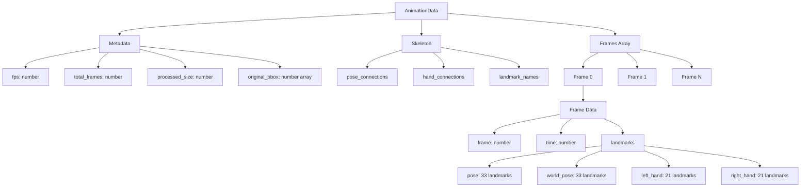
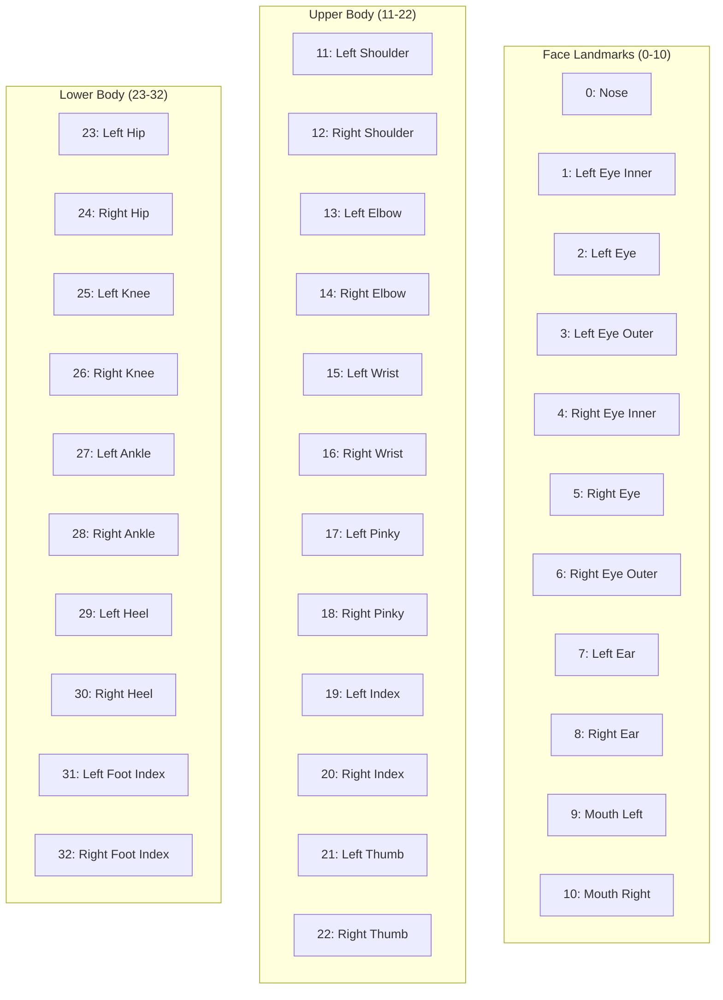
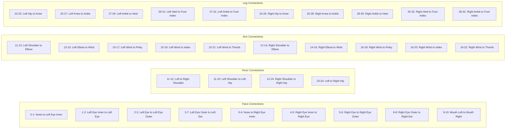
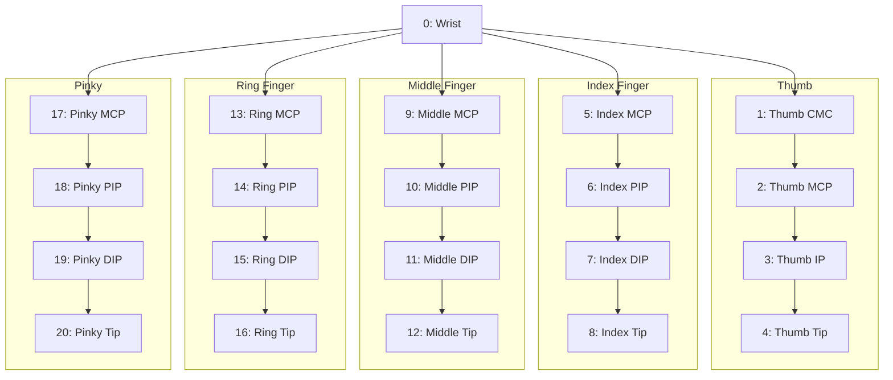
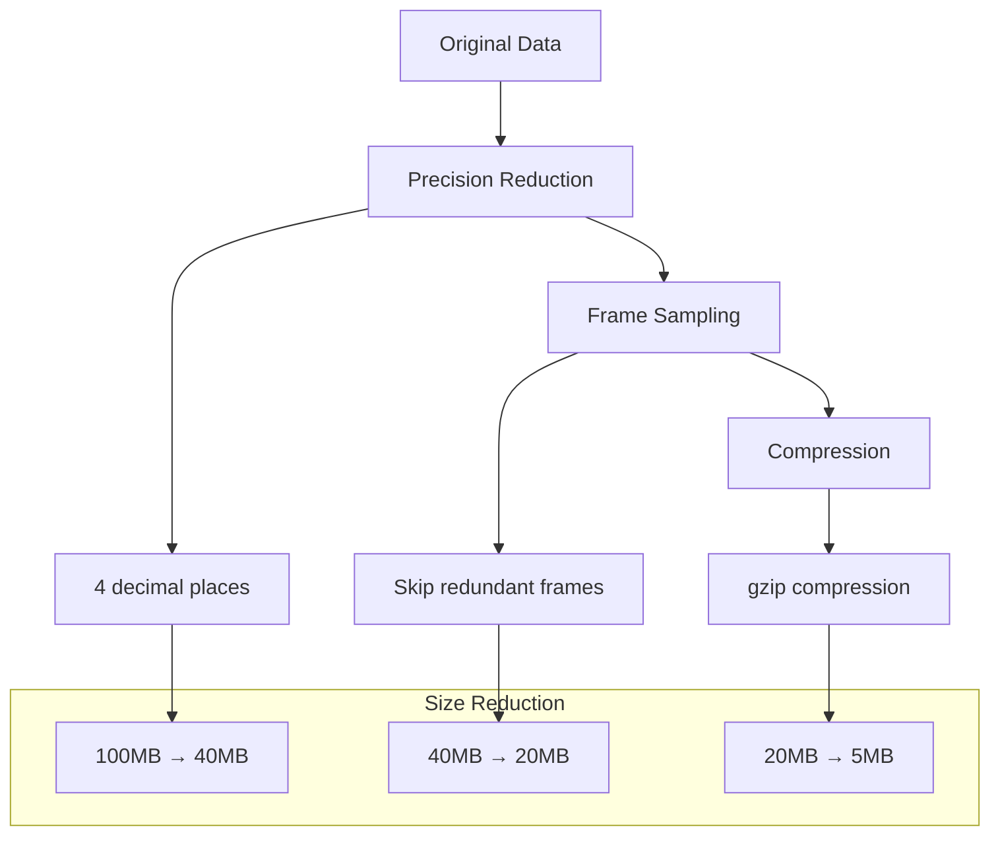
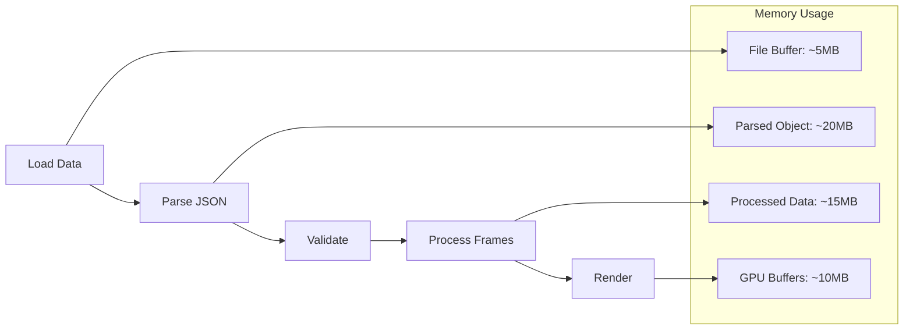

# Data Models Documentation

This document provides detailed information about the data structures used in the Tai Chi Motion Capture Application, including the animation data format, pose landmark definitions, and skeletal connections.

## Animation Data Structure

The animation data follows a hierarchical JSON structure designed for efficient storage and processing of motion capture data.



## Pose Landmarks

The application uses 33 pose landmarks based on the MediaPipe Pose model.



## Skeletal Connections

The skeletal structure defines how landmarks are connected to form bones.



## Hand Landmarks

Each hand contains 21 landmarks forming the hand skeleton.



## Coordinate Systems

The application uses different coordinate systems for various purposes.

```mermaid
graph LR
    subgraph "Video Coordinates"
        VC[0-1 normalized<br/>Origin: top-left]
    end
    
    subgraph "World Coordinates"
        WC[Metric units<br/>Origin: center]
    end
    
    subgraph "Three.js Scene"
        TC[-1 to 1 range<br/>Y-up, Origin: center]
    end
    
    VC -->|Transform| WC
    WC -->|Convert| TC
    
    subgraph "Transformations"
        T1[X: (x - 0.5) * 2]
        T2[Y: -(y - 0.5) * 2]
        T3[Z: -z * 2]
        T4[Mirror: x * -1]
    end
```

## Data Validation Schema

The validation process ensures data integrity and compatibility.

```mermaid
flowchart TD
    Start[Validate AnimationData]
    
    VM[Validate Metadata]
    VS[Validate Skeleton]
    VF[Validate Frames]
    
    Start --> VM
    Start --> VS
    Start --> VF
    
    VM --> VFPS{fps > 0?}
    VM --> VTF{total_frames > 0?}
    VM --> VPS{processed_size valid?}
    VM --> VBB{bbox array[4]?}
    
    VS --> VPC{pose_connections array?}
    VS --> VHC{hand_connections array?}
    VS --> VLN{landmark_names object?}
    
    VF --> VFA{frames array?}
    VF --> VFL{frames.length > 0?}
    VF --> VFF{each frame valid?}
    
    VFF --> VFN{frame number valid?}
    VFF --> VFT{time valid?}
    VFF --> VFP{pose landmarks valid?}
    
    VFPS -->|Yes| Valid
    VFPS -->|No| Invalid
    VTF -->|Yes| Valid
    VTF -->|No| Invalid
    
    Valid[Valid Data]
    Invalid[Invalid Data]
```

## Example JSON Structure

```json
{
  "metadata": {
    "fps": 30,
    "total_frames": 120,
    "processed_size": 1920,
    "original_bbox": [0, 0, 1920, 1080]
  },
  "skeleton": {
    "pose_connections": [
      [0, 1], [1, 2], [2, 3], [3, 7],
      [0, 4], [4, 5], [5, 6], [6, 8],
      [9, 10], [11, 12], [11, 13], [13, 15],
      [12, 14], [14, 16], [11, 23], [12, 24],
      [23, 24], [23, 25], [25, 27], [27, 29],
      [29, 31], [27, 31], [24, 26], [26, 28],
      [28, 30], [30, 32], [28, 32]
    ],
    "hand_connections": [
      [0, 1], [1, 2], [2, 3], [3, 4],
      [0, 5], [5, 6], [6, 7], [7, 8],
      [0, 9], [9, 10], [10, 11], [11, 12],
      [0, 13], [13, 14], [14, 15], [15, 16],
      [0, 17], [17, 18], [18, 19], [19, 20],
      [5, 9], [9, 13], [13, 17]
    ],
    "landmark_names": {
      "pose": [
        "nose", "left_eye_inner", "left_eye", "left_eye_outer",
        "right_eye_inner", "right_eye", "right_eye_outer",
        "left_ear", "right_ear", "mouth_left", "mouth_right",
        "left_shoulder", "right_shoulder", "left_elbow", "right_elbow",
        "left_wrist", "right_wrist", "left_pinky", "right_pinky",
        "left_index", "right_index", "left_thumb", "right_thumb",
        "left_hip", "right_hip", "left_knee", "right_knee",
        "left_ankle", "right_ankle", "left_heel", "right_heel",
        "left_foot_index", "right_foot_index"
      ],
      "hand": [
        "wrist", "thumb_cmc", "thumb_mcp", "thumb_ip", "thumb_tip",
        "index_finger_mcp", "index_finger_pip", "index_finger_dip", "index_finger_tip",
        "middle_finger_mcp", "middle_finger_pip", "middle_finger_dip", "middle_finger_tip",
        "ring_finger_mcp", "ring_finger_pip", "ring_finger_dip", "ring_finger_tip",
        "pinky_mcp", "pinky_pip", "pinky_dip", "pinky_tip"
      ]
    }
  },
  "frames": [
    {
      "frame": 0,
      "time": 0.0,
      "landmarks": {
        "pose": [
          [0.5, 0.3, 0.5],
          [0.48, 0.28, 0.5],
          // ... 31 more landmarks
        ],
        "world_pose": [
          [0.0, 0.4, 0.0, 0.99],
          [-0.04, 0.44, 0.0, 0.98],
          // ... 31 more landmarks with visibility
        ],
        "left_hand": null,
        "right_hand": null
      }
    }
    // ... more frames
  ]
}
```

## Performance Considerations

### Data Size Optimization



### Memory Management



---

For more information, see:
- [API Reference](./README.md)
- [Architecture Overview](../architecture/README.md)
- [Usage Guide](../guides/usage.md)