# Architecture Overview

This document provides a comprehensive overview of the Tai Chi Motion Capture Application's architecture, including system design, component relationships, and data flow.

## System Architecture

The application follows a multi-process architecture typical of Electron applications, with clear separation between the main process and renderer process.

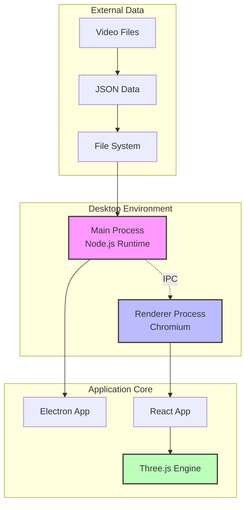

## Component Architecture

The application is built using a component-based architecture with React and Three.js integration.

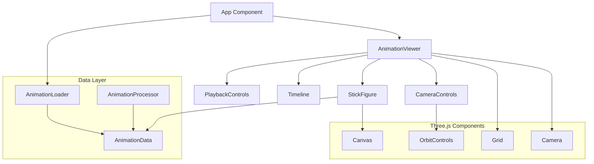

## Data Flow Architecture

The data flow follows a unidirectional pattern from video processing to 3D rendering.

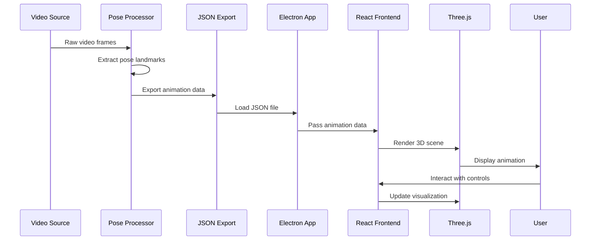

## Process Communication

Electron's IPC (Inter-Process Communication) enables secure communication between main and renderer processes.

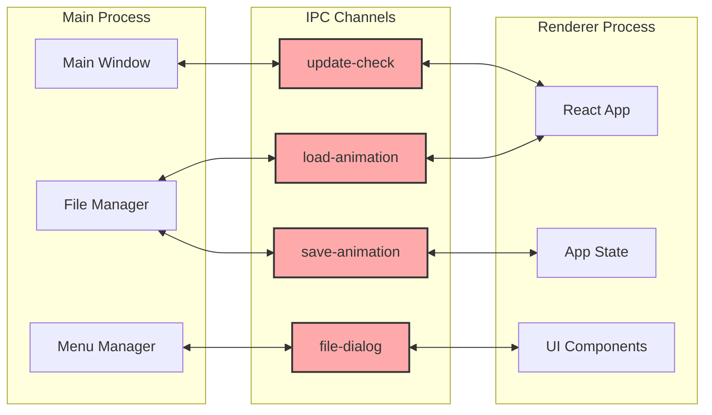

## State Management

The application uses React's built-in state management with hooks for managing animation state.

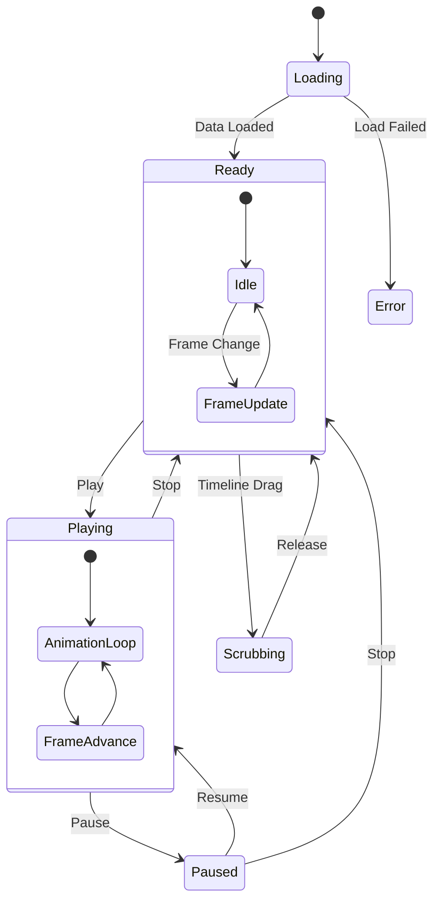

## 3D Rendering Pipeline

The Three.js rendering pipeline processes animation data into visual output.

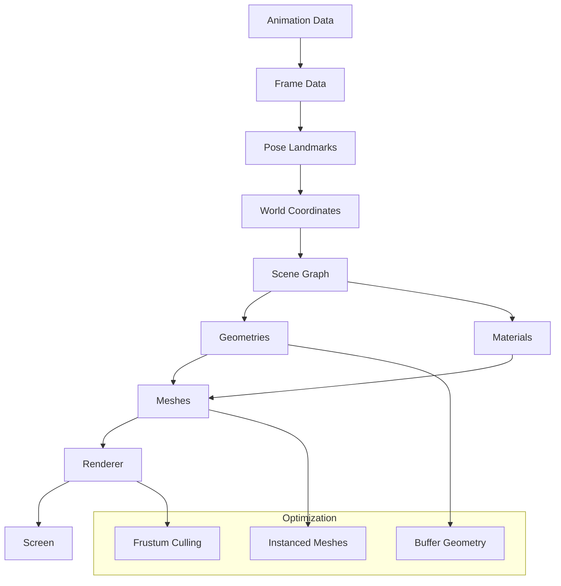

## Module Dependencies

The application's module structure and dependencies.

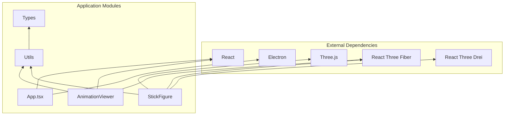

## Deployment Architecture

The application packaging and deployment structure for different platforms.

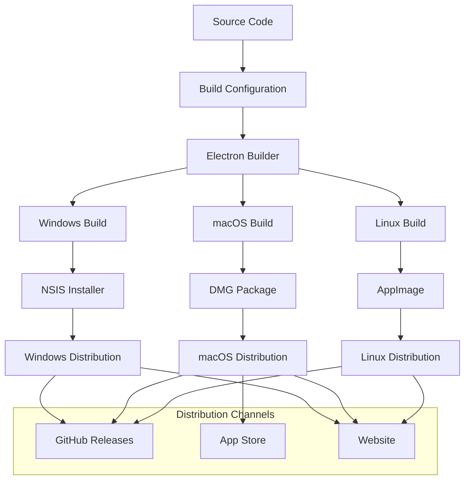

## Security Architecture

Security considerations and implementation.

```mermaid
graph TD
    subgraph "Security Layers"
        CSP[Content Security Policy]
        CTX[Context Isolation]
        PRE[Preload Scripts]
        SBX[Sandbox Mode]
    end
    
    subgraph "IPC Security"
        VAL[Input Validation]
        SAN[Data Sanitization]
        WHT[Channel Whitelist]
    end
    
    subgraph "File Access"
        DLG[Dialog API Only]
        RST[Restricted Paths]
        VAL2[File Validation]
    end
    
    CSP --> CTX
    CTX --> PRE
    PRE --> SBX
    
    VAL --> SAN
    SAN --> WHT
    
    DLG --> RST
    RST --> VAL2
```

## Performance Optimization

Key performance optimization strategies implemented in the application.

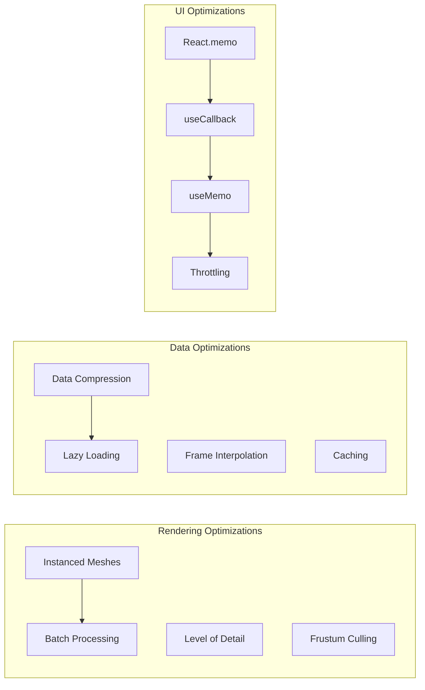

## Error Handling Architecture

Comprehensive error handling and recovery mechanisms.

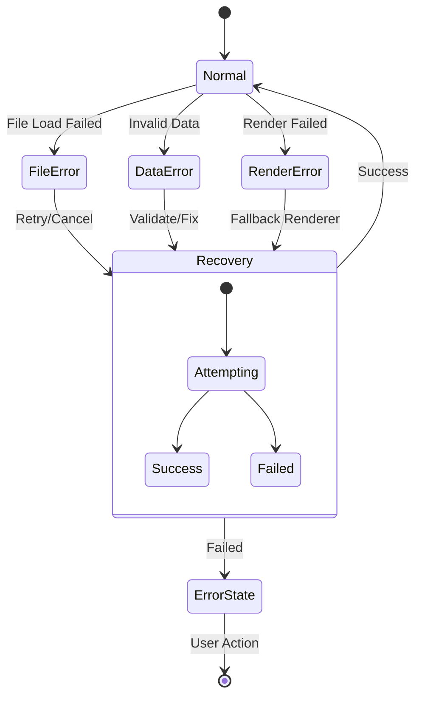

---

For more detailed information about specific components, see:
- [Component Documentation](../components/README.md)
- [API Reference](../api/README.md)
- [Data Models](../api/data-models.md)