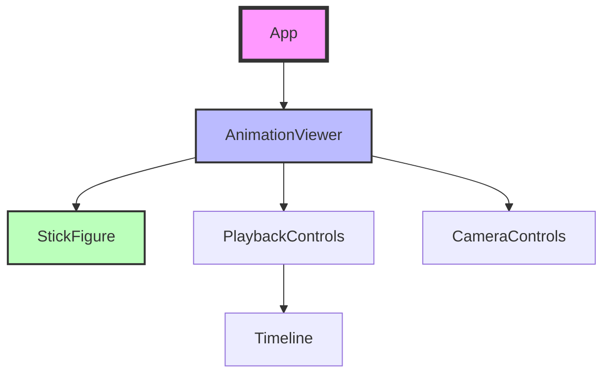
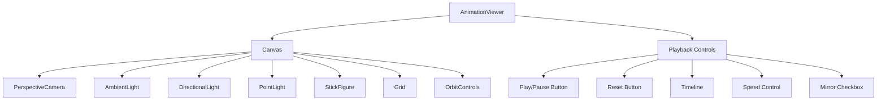
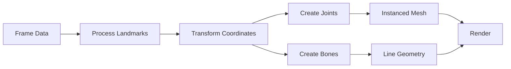
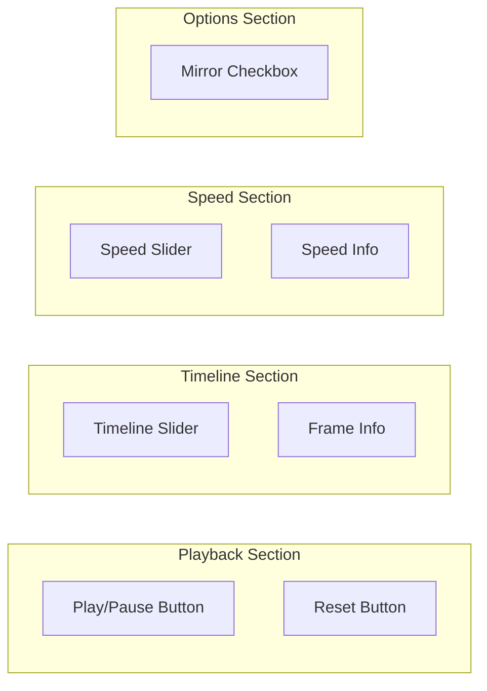
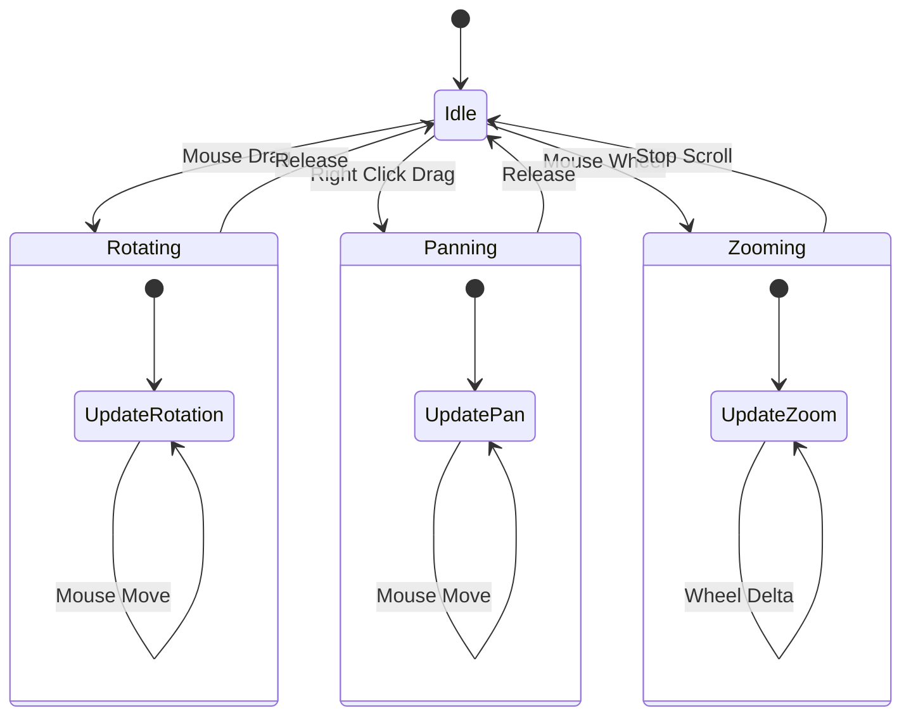
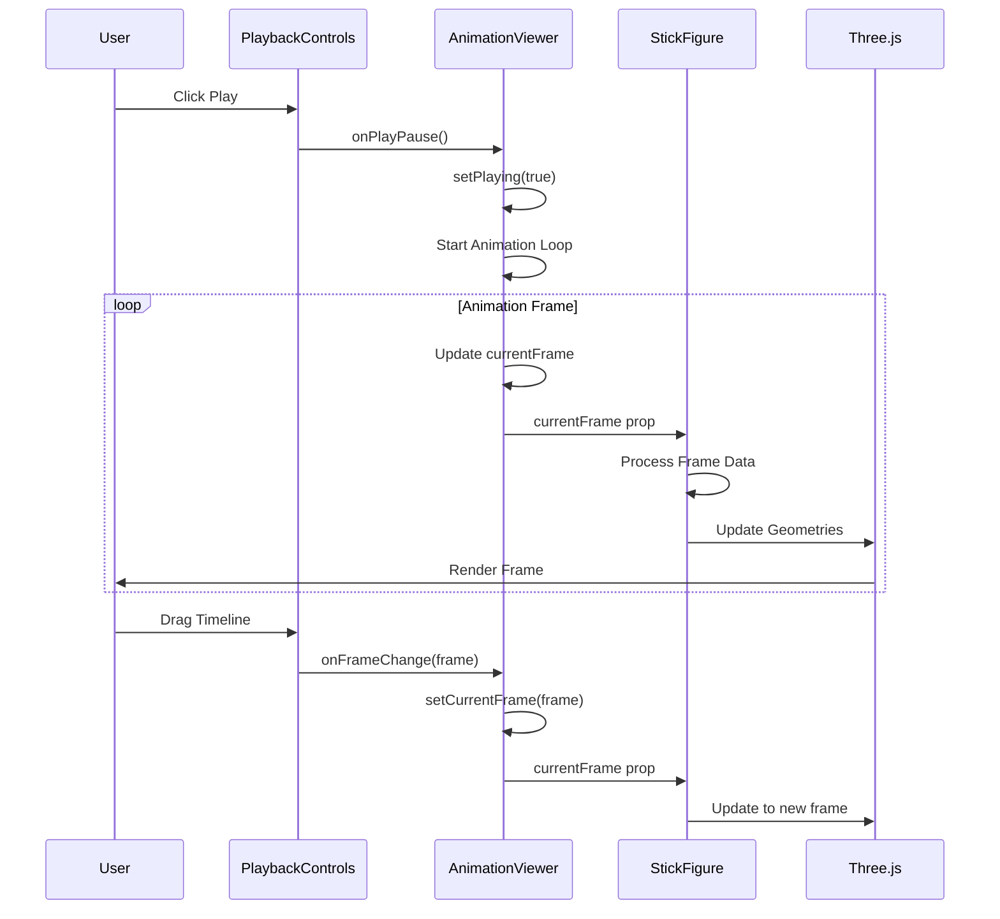

# Component Documentation

This document provides detailed documentation for all React components in the Tai Chi Motion Capture Application.

## Component Hierarchy



## Core Components

### App Component

The root component that manages the application state and data loading.

**Location:** `/src/App.tsx`

**Responsibilities:**
- Load animation data (mock or from file)
- Handle loading and error states
- Render the main AnimationViewer

**State:**
```typescript
const [animationData, setAnimationData] = useState<AnimationData | null>(null);
const [loading, setLoading] = useState(true);
const [error, setError] = useState<string | null>(null);
```

**Props:** None (root component)

**Example Usage:**
```tsx
function App() {
  // Component implementation
  return (
    <div className="App">
      <AnimationViewer animationData={animationData} />
    </div>
  );
}
```

### AnimationViewer Component

The main viewer component that orchestrates 3D rendering and playback controls.

**Location:** `/src/components/AnimationViewer.tsx`

**Props:**
```typescript
interface AnimationViewerProps {
  animationData: AnimationData;
}
```

**State:**
```typescript
const [playing, setPlaying] = useState(false);
const [currentFrame, setCurrentFrame] = useState(0);
const [playbackSpeed, setPlaybackSpeed] = useState(1.0);
const [mirrored, setMirrored] = useState(false);
```

**Features:**
- 3D scene rendering with Three.js
- Playback control integration
- Animation loop management
- Responsive layout

**Component Structure:**


### StickFigure Component

The 3D stick figure renderer that visualizes pose data.

**Location:** `/src/components/StickFigure.tsx`

**Props:**
```typescript
interface StickFigureProps {
  animationData: AnimationData;
  currentFrame: number;
  mirrored: boolean;
  showJoints?: boolean;
  showBones?: boolean;
  jointSize?: number;
  boneWidth?: number;
}
```

**Key Features:**
- Instanced mesh rendering for joints
- Dynamic bone connections
- Hand visualization support
- Performance optimizations

**Rendering Process:**


**Coordinate Transformation:**
```typescript
// Video to Three.js coordinates
const x = (landmark[0] - 0.5) * 2 * (mirrored ? -1 : 1);
const y = -(landmark[1] - 0.5) * 2;
const z = -landmark[2] * 2;
```

### PlaybackControls Component

Controls for animation playback and navigation.

**Location:** `/src/components/PlaybackControls.tsx`

**Props:**
```typescript
interface PlaybackControlsProps {
  playing: boolean;
  onPlayPause: () => void;
  onReset: () => void;
  currentFrame: number;
  totalFrames: number;
  onFrameChange: (frame: number) => void;
  playbackSpeed: number;
  onSpeedChange: (speed: number) => void;
  mirrored: boolean;
  onMirrorToggle: (mirrored: boolean) => void;
}
```

**Control Layout:**


### Timeline Component

Frame timeline for scrubbing through animation.

**Location:** `/src/components/Timeline.tsx`

**Props:**
```typescript
interface TimelineProps {
  currentFrame: number;
  totalFrames: number;
  onChange: (frame: number) => void;
  markers?: number[];
  disabled?: boolean;
}
```

**Features:**
- Frame-accurate scrubbing
- Visual progress indication
- Optional frame markers
- Smooth interaction

### CameraControls Component

3D camera control configuration wrapper.

**Location:** `/src/components/CameraControls.tsx`

**Props:**
```typescript
interface CameraControlsProps {
  enablePan?: boolean;
  enableZoom?: boolean;
  enableRotate?: boolean;
  zoomSpeed?: number;
  panSpeed?: number;
  rotateSpeed?: number;
  target?: [number, number, number];
  minDistance?: number;
  maxDistance?: number;
}
```

**Control Interactions:**


## Styling

All components use CSS modules for scoped styling.

### AnimationViewer Styles

**File:** `/src/styles/AnimationViewer.css`

```css
.animation-viewer {
  width: 100%;
  height: 100vh;
  display: flex;
  flex-direction: column;
}

.viewer-canvas {
  flex: 1;
  position: relative;
  background-color: #1a1a1a;
}

.animation-controls {
  background-color: #2a2a2a;
  padding: 20px;
  color: #ffffff;
  box-shadow: 0 -2px 10px rgba(0,0,0,0.3);
}
```

## Component Communication



## Performance Optimization

### React Optimizations

```typescript
// Memoized components
const StickFigure = React.memo(StickFigureComponent);

// Memoized callbacks
const handleFrameChange = useCallback((frame: number) => {
  setCurrentFrame(frame);
  frameRef.current = frame;
}, []);

// Memoized values
const jointGeometry = useMemo(
  () => new THREE.SphereGeometry(jointSize, 16, 16), 
  [jointSize]
);
```

### Three.js Optimizations

```typescript
// Instanced meshes for joints
<instancedMesh
  ref={instancedMeshRef}
  args={[jointGeometry, jointMaterial, 33]}
  frustumCulled={false}
/>

// Geometry disposal
useEffect(() => {
  return () => {
    geometry.dispose();
    material.dispose();
  };
}, []);
```

## Component Testing

### Unit Testing Strategy

```typescript
// Example test for PlaybackControls
describe('PlaybackControls', () => {
  it('should toggle play/pause state', () => {
    const onPlayPause = jest.fn();
    const { getByText } = render(
      <PlaybackControls
        playing={false}
        onPlayPause={onPlayPause}
        // ... other props
      />
    );
    
    fireEvent.click(getByText('▶ Play'));
    expect(onPlayPause).toHaveBeenCalled();
  });
});
```

### Integration Testing

```typescript
// Example integration test
describe('AnimationViewer Integration', () => {
  it('should update frame when timeline changes', async () => {
    const { container } = render(
      <AnimationViewer animationData={mockData} />
    );
    
    const timeline = container.querySelector('input[type="range"]');
    fireEvent.change(timeline, { target: { value: '50' } });
    
    // Verify frame update
    expect(screen.getByText(/Frame: 51/)).toBeInTheDocument();
  });
});
```

---

For more information, see:
- [API Reference](../api/README.md)
- [Architecture Overview](../architecture/README.md)
- [Usage Guide](../guides/usage.md)