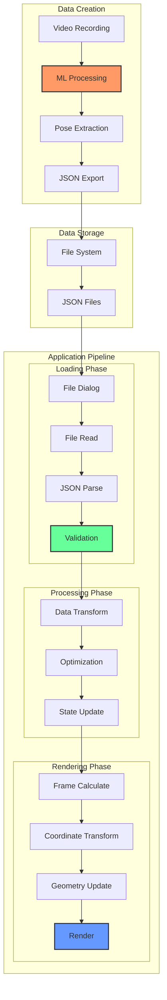
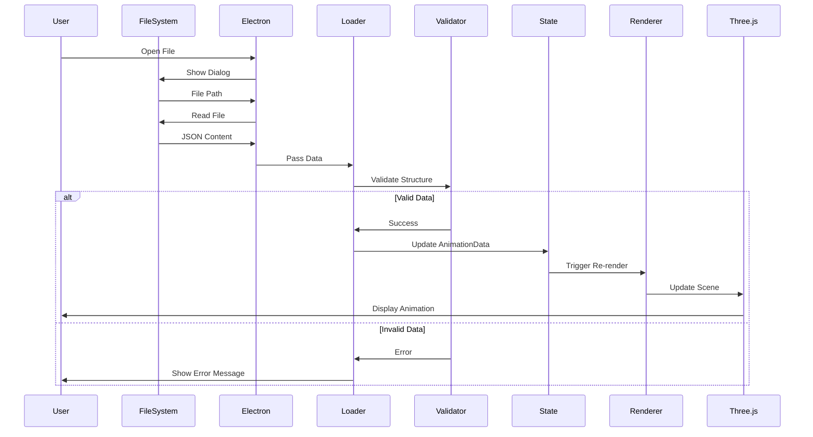
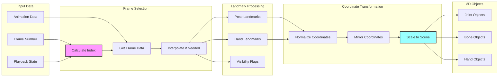
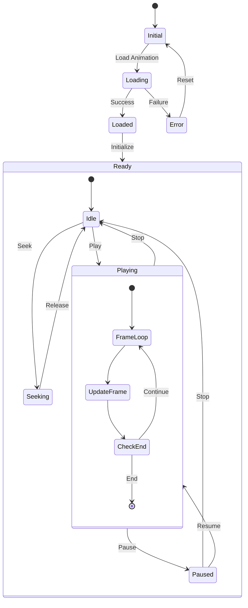
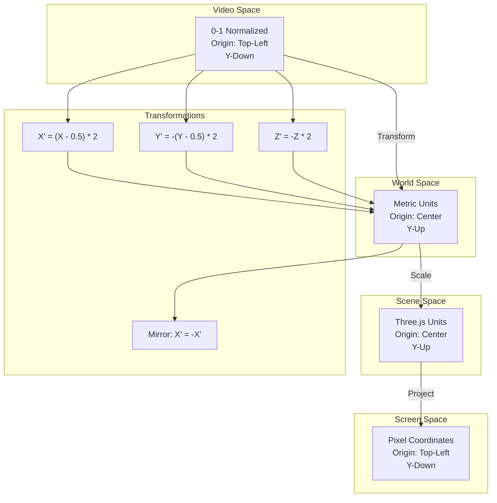
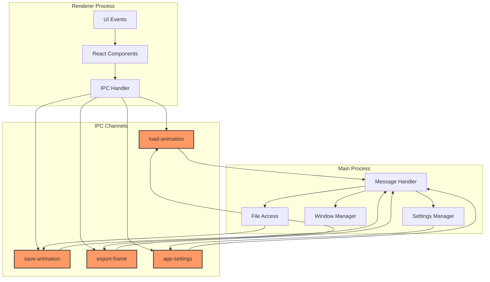
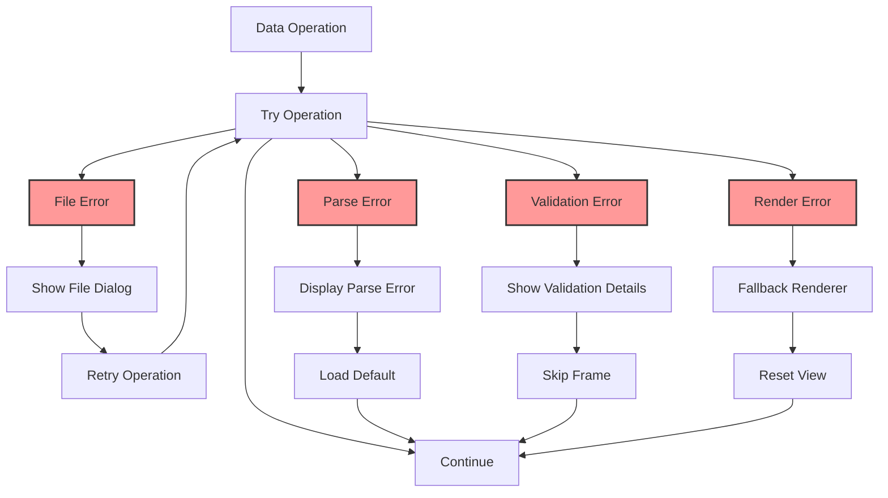
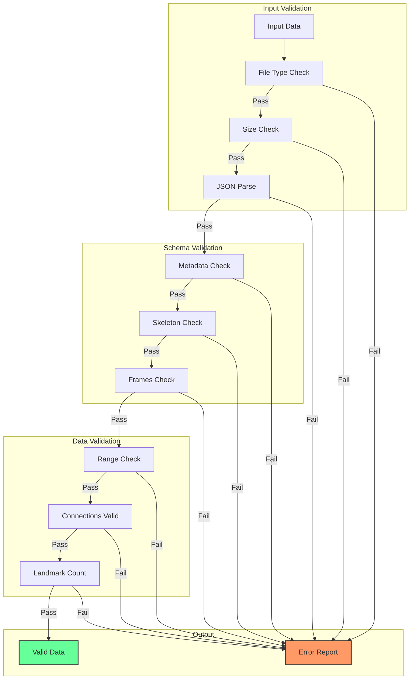
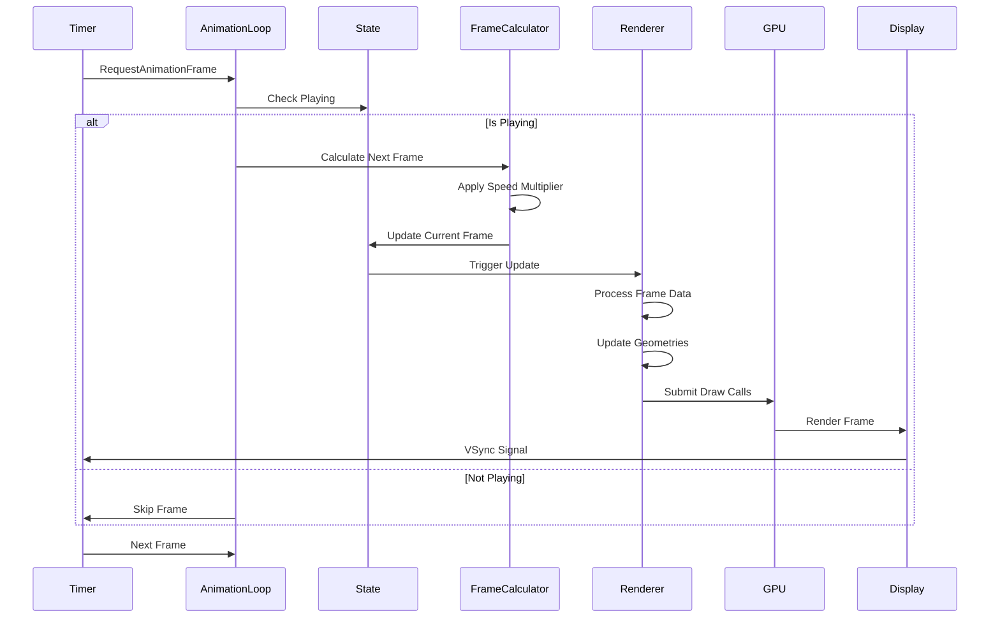

# Data Flow Diagrams

This document illustrates the complete data flow within the Tai Chi Motion Capture Application, from video processing to 3D visualization.

## End-to-End Data Pipeline

## Animation Data Lifecycle

## Frame Processing Pipeline

## State Management Flow

## Coordinate System Transformations

## IPC Data Flow

## Performance Data Flow

```mermaid
graph LR
    subgraph "Data Input"
        RD[Raw Data<br/>~10MB]
    end
    
    subgraph "Optimization Pipeline"
        PR[Precision Reduction<br/>4 decimals]
        FC[Frame Culling<br/>Remove duplicates]
        DC[Data Compression<br/>Remove nulls]
    end
    
    subgraph "Memory Management"
        BP[Buffer Pool<br/>Reuse objects]
        GC[Garbage Collection<br/>Scheduled cleanup]
        LZ[Lazy Loading<br/>On-demand frames]
    end
    
    subgraph "Rendering Pipeline"
        IM[Instanced Meshes<br/>Single draw call]
        FC2[Frustum Culling<br/>Skip off-screen]
        LOD[Level of Detail<br/>Distance-based]
    end
    
    subgraph "Output"
        OP[Optimized<br/>~2MB]
        FPS[60 FPS]
    end
    
    RD --> PR
    PR --> FC
    FC --> DC
    DC --> BP
    BP --> GC
    GC --> LZ
    LZ --> IM
    IM --> FC2
    FC2 --> LOD
    LOD --> OP
    LOD --> FPS
    
    style RD fill:#f66,stroke:#333,stroke-width:2px
    style OP fill:#6f6,stroke:#333,stroke-width:2px
    style FPS fill:#6f6,stroke:#333,stroke-width:2px
```

## Error Handling Flow

## Data Validation Pipeline

## Real-time Update Flow

---

For more details, see:
- [System Architecture](./system-architecture.md)
- [API Reference](../api/README.md)
- [Component Documentation](../components/README.md)