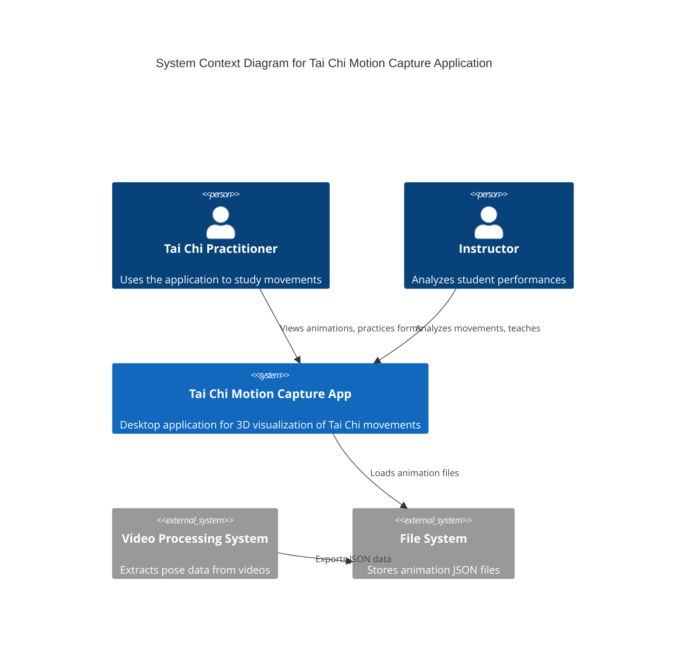
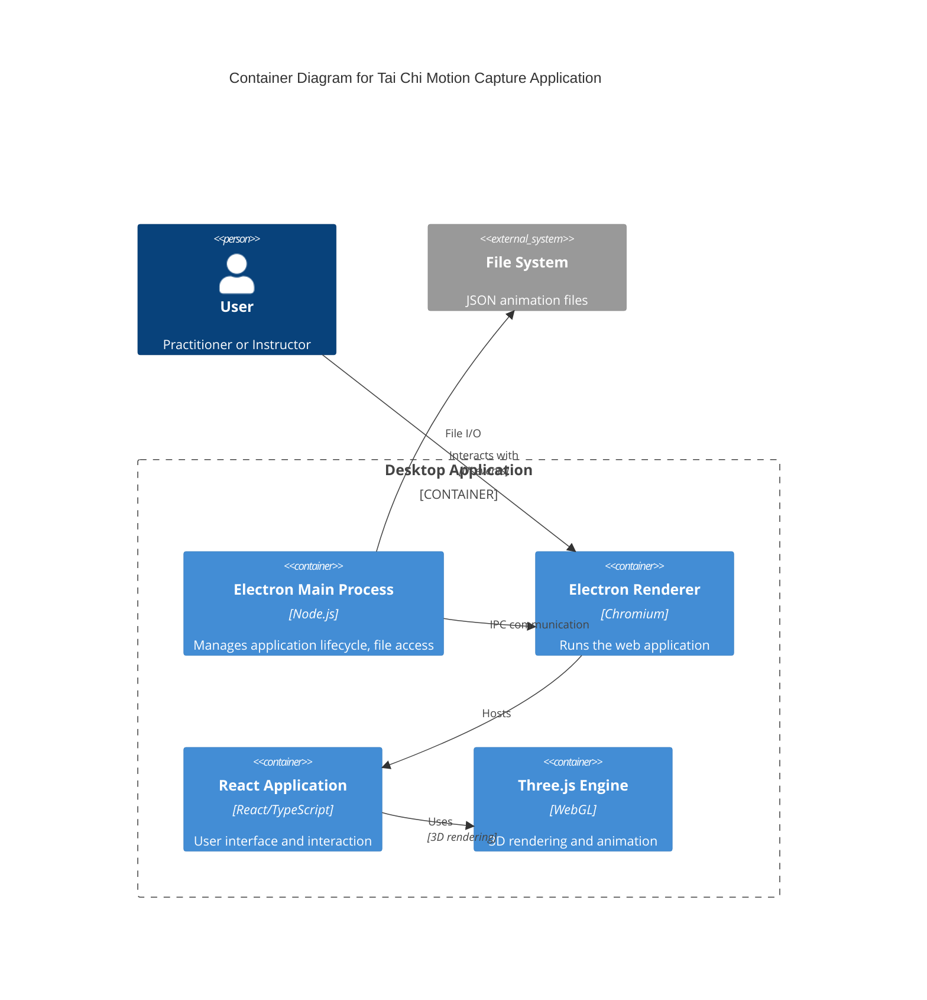
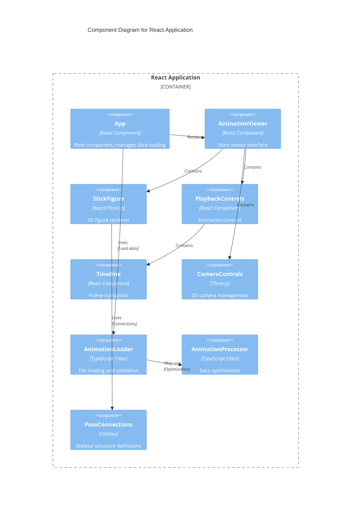
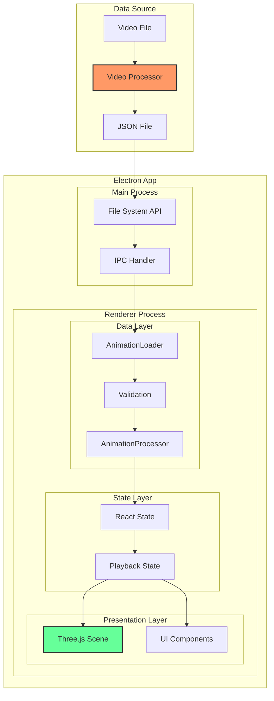
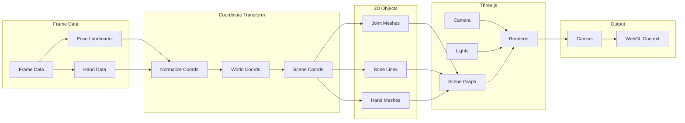
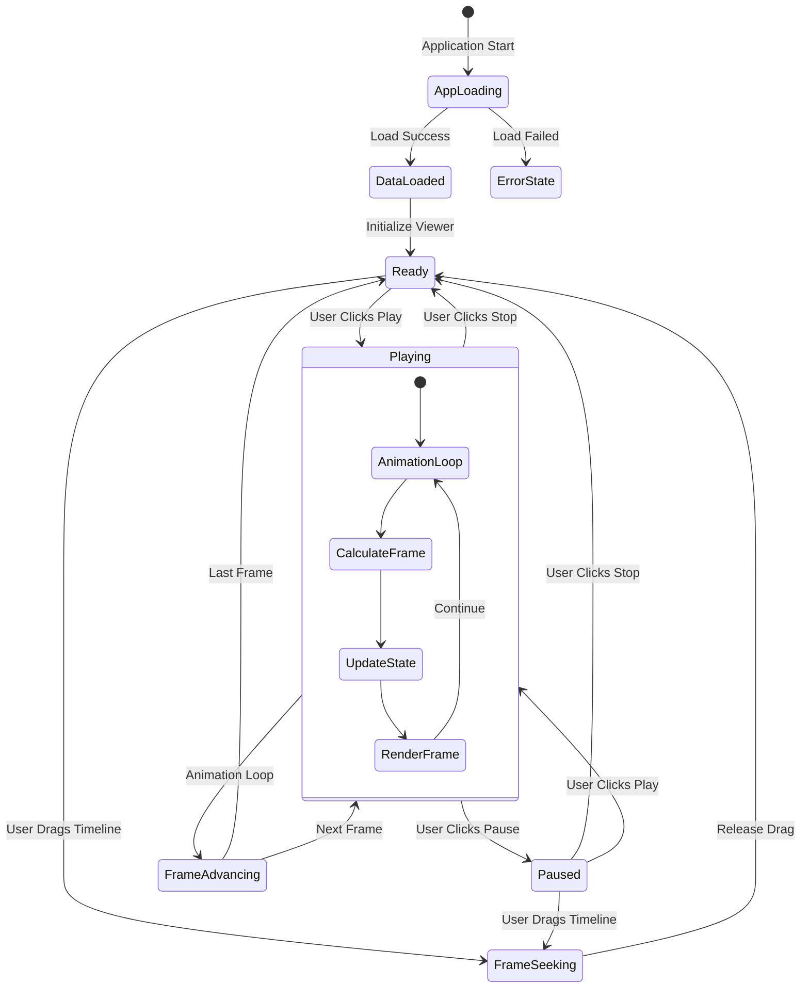
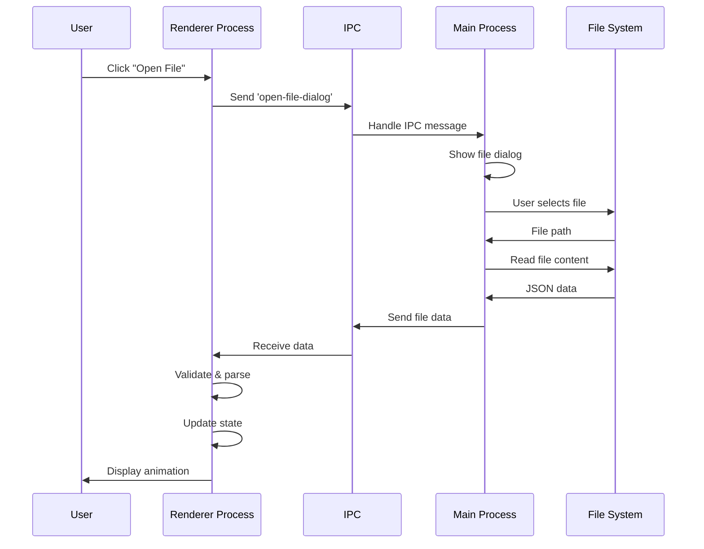
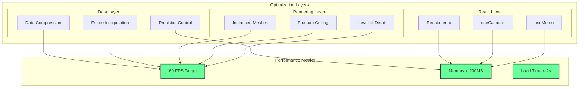
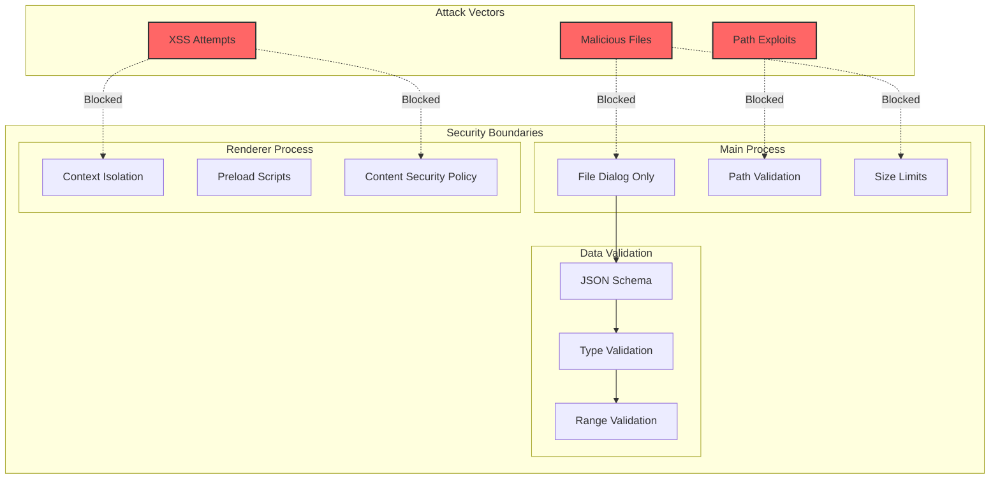
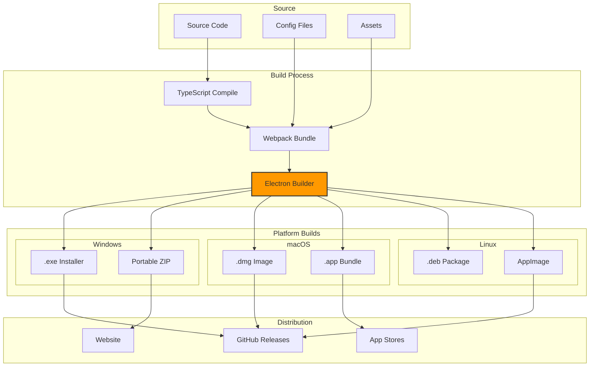

# System Architecture Diagrams

This document contains detailed architectural diagrams for the Tai Chi Motion Capture Application, illustrating the system's structure, data flow, and component relationships.

## High-Level System Architecture



## Container Architecture



## Component Architecture



## Data Flow Architecture



## Rendering Pipeline



## State Management Flow



## IPC Communication Architecture



## Module Dependency Graph

```mermaid
graph TD
    subgraph "External Dependencies"
        E[Electron]
        R[React]
        T[Three.js]
        RTF[@react-three/fiber]
        RTD[@react-three/drei]
        TS[TypeScript]
    end
    
    subgraph "Application Core"
        APP[App.tsx]
        IDX[index.tsx]
    end
    
    subgraph "Components"
        AV[AnimationViewer]
        SF[StickFigure]
        PC[PlaybackControls]
        TL[Timeline]
        CC[CameraControls]
    end
    
    subgraph "Utilities"
        AL[AnimationLoader]
        AP[AnimationProcessor]
        PS[PoseConnections]
    end
    
    subgraph "Types"
        TY[types/index.ts]
    end
    
    E --> APP
    R --> IDX
    R --> APP
    R --> AV
    T --> SF
    RTF --> AV
    RTF --> SF
    RTD --> AV
    TS --> TY
    
    IDX --> APP
    APP --> AV
    AV --> SF
    AV --> PC
    AV --> CC
    PC --> TL
    
    APP --> AL
    AL --> TY
    AP --> TY
    SF --> PS
    PS --> TY
    
    style E fill:#61dafb,stroke:#333,stroke-width:2px
    style R fill:#61dafb,stroke:#333,stroke-width:2px
    style T fill:#049ef4,stroke:#333,stroke-width:2px
```

## Performance Architecture



## Security Architecture



## Deployment Architecture



---

For implementation details, see:
- [Architecture Overview](../architecture/README.md)
- [Component Documentation](../components/README.md)
- [API Reference](../api/README.md)