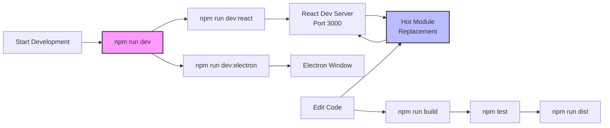

# Development Setup Guide

This guide will help you set up your development environment for the Tai Chi Motion Capture Application.

## Prerequisites

Before you begin, ensure you have the following installed on your system:

### Required Software

- **Node.js** (v16.x or higher)
  - Download from [nodejs.org](https://nodejs.org/)
  - Verify installation: `node --version`

- **npm** (comes with Node.js) or **yarn**
  - Verify npm: `npm --version`
  - Or install yarn: `npm install -g yarn`

- **Git**
  - Download from [git-scm.com](https://git-scm.com/)
  - Verify installation: `git --version`

### Recommended Tools

- **Visual Studio Code**
  - Download from [code.visualstudio.com](https://code.visualstudio.com/)
  - Recommended extensions:
    - ESLint
    - Prettier
    - TypeScript and JavaScript Language Features
    - React snippets
    - Three.js snippets

- **Chrome DevTools** or **React Developer Tools**
  - For debugging React components
  - Chrome extension available in Chrome Web Store

## Installation Steps

### 1. Clone the Repository

```bash
# Using HTTPS
git clone https://github.com/your-org/taichi-electron-app.git

# Using SSH
git clone git@github.com:your-org/taichi-electron-app.git

# Navigate to project directory
cd taichi-electron-app
```

### 2. Install Dependencies

```bash
# Using npm
npm install

# Or using yarn
yarn install
```

This will install all required dependencies including:
- Electron
- React
- Three.js and related packages
- Development tools

### 3. Verify Installation

```bash
# Check if all dependencies are installed
npm list --depth=0

# Run a quick test
npm run dev:react
```

## Development Workflow



### Running in Development Mode

The application uses a concurrent development setup:

```bash
# Start both React dev server and Electron
npm run dev
```

This command will:
1. Start the React development server on port 3000
2. Wait for the React server to be ready
3. Launch Electron pointing to localhost:3000

### Individual Development Commands

```bash
# Start only React development server
npm run dev:react

# Start only Electron (requires React server running)
npm run dev:electron

# Build React app
npm run build:react

# Run tests
npm test
```

## Project Structure

```
taichi-electron-app/
├── package.json           # Project configuration
├── tsconfig.json         # TypeScript configuration
├── public/               # Static assets
│   └── index.html       # HTML template
├── src/                 # Source code
│   ├── index.tsx       # React entry point
│   ├── App.tsx         # Root component
│   ├── components/     # React components
│   │   ├── AnimationViewer.tsx
│   │   ├── StickFigure.tsx
│   │   ├── PlaybackControls.tsx
│   │   ├── Timeline.tsx
│   │   └── CameraControls.tsx
│   ├── types/          # TypeScript definitions
│   │   └── index.ts
│   ├── utils/          # Utility functions
│   │   ├── animationLoader.ts
│   │   └── poseConnections.ts
│   └── styles/         # CSS files
│       └── AnimationViewer.css
├── docs/               # Documentation
│   ├── README.md
│   ├── architecture/
│   ├── api/
│   ├── components/
│   └── guides/
└── node_modules/       # Dependencies
```

## Environment Configuration

### Development Environment Variables

Create a `.env` file in the project root:

```env
# React environment variables
REACT_APP_API_URL=http://localhost:3001
REACT_APP_DEBUG=true

# Electron environment variables
ELECTRON_IS_DEV=1
ELECTRON_DISABLE_SECURITY_WARNINGS=true
```

### TypeScript Configuration

The project uses TypeScript for type safety. Key configuration in `tsconfig.json`:

```json
{
  "compilerOptions": {
    "target": "es5",
    "lib": ["dom", "es2017"],
    "jsx": "react-jsx",
    "module": "esnext",
    "strict": true,
    "esModuleInterop": true,
    "skipLibCheck": true,
    "forceConsistentCasingInFileNames": true
  },
  "include": ["src"]
}
```

## Common Setup Issues

### Issue: Node Version Mismatch

**Problem:** Package installation fails due to Node version

**Solution:**
```bash
# Check current Node version
node --version

# Use nvm to switch versions
nvm install 16
nvm use 16
```

### Issue: Electron Not Starting

**Problem:** Electron window doesn't open

**Solution:**
1. Ensure React dev server is running first
2. Check if port 3000 is available
3. Clear Electron cache:
```bash
# Clear Electron cache
rm -rf ~/.electron
npm run dev
```

### Issue: Three.js WebGL Errors

**Problem:** WebGL context errors in console

**Solution:**
1. Update graphics drivers
2. Enable hardware acceleration in Chrome
3. Check WebGL support:
```javascript
// Test WebGL support
const canvas = document.createElement('canvas');
const gl = canvas.getContext('webgl') || canvas.getContext('experimental-webgl');
console.log(gl ? 'WebGL supported' : 'WebGL not supported');
```

### Issue: TypeScript Compilation Errors

**Problem:** Type errors during build

**Solution:**
```bash
# Clean install
rm -rf node_modules package-lock.json
npm install

# Check for type issues
npm run type-check
```

## IDE Setup

### Visual Studio Code

Recommended settings (`.vscode/settings.json`):

```json
{
  "editor.formatOnSave": true,
  "editor.codeActionsOnSave": {
    "source.fixAll.eslint": true
  },
  "typescript.tsdk": "node_modules/typescript/lib",
  "files.associations": {
    "*.tsx": "typescriptreact",
    "*.ts": "typescript"
  }
}
```

### Debugging Configuration

Create `.vscode/launch.json`:

```json
{
  "version": "0.2.0",
  "configurations": [
    {
      "name": "Electron: Main",
      "type": "node",
      "request": "launch",
      "protocol": "inspector",
      "runtimeExecutable": "${workspaceFolder}/node_modules/.bin/electron",
      "args": ["."],
      "env": {
        "ELECTRON_IS_DEV": "1"
      }
    },
    {
      "name": "React: Chrome",
      "type": "chrome",
      "request": "launch",
      "url": "http://localhost:3000",
      "webRoot": "${workspaceFolder}/src"
    }
  ]
}
```

## Next Steps

After setting up your development environment:

1. Read the [Architecture Overview](../architecture/README.md)
2. Review the [Component Documentation](../components/README.md)
3. Check the [API Reference](../api/README.md)
4. Follow the [Building Guide](./building.md) for production builds

---

For more help, see:
- [Troubleshooting Guide](./troubleshooting.md)
- [Contributing Guidelines](../CONTRIBUTING.md)
- [Project README](../../README.md)