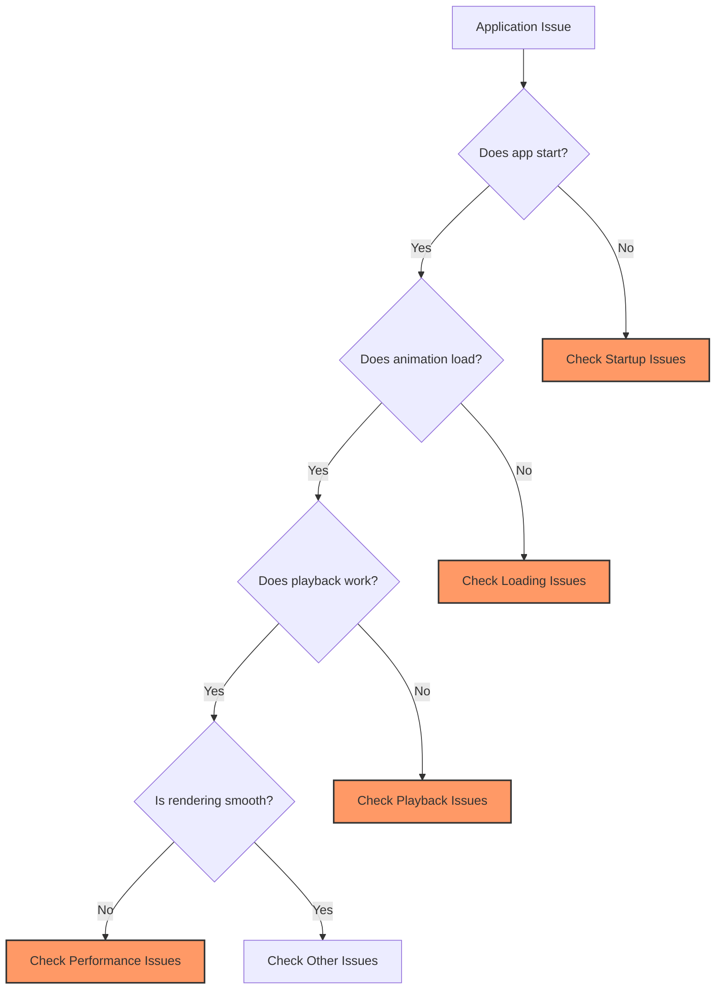
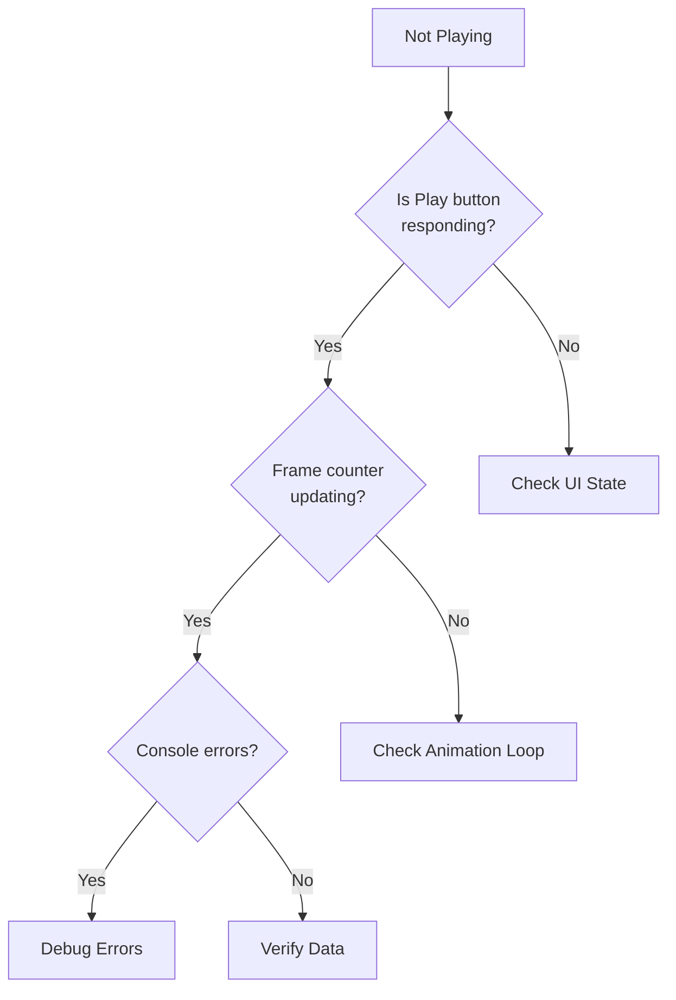
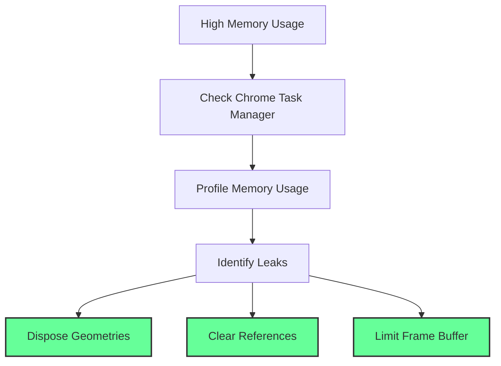

# Troubleshooting Guide

This guide helps resolve common issues with the Tai Chi Motion Capture Application.

## Quick Diagnostics



## Startup Issues

### Application Won't Launch

#### Symptoms
- Double-clicking the app does nothing
- App crashes immediately
- Error dialog appears

#### Solutions

**1. Check System Requirements**
```bash
# Verify Node.js version (if running from source)
node --version  # Should be 16.x or higher

# Check available memory
# Windows: wmic OS get TotalVisibleMemorySize
# macOS/Linux: free -h
```

**2. Clear Application Cache**
```bash
# Windows
rmdir /s %APPDATA%\taichi-motion-capture

# macOS
rm -rf ~/Library/Application\ Support/taichi-motion-capture

# Linux
rm -rf ~/.config/taichi-motion-capture
```

**3. Run with Debug Mode**
```bash
# Windows
set ELECTRON_ENABLE_LOGGING=1
TaiChiMotionCapture.exe

# macOS/Linux
ELECTRON_ENABLE_LOGGING=1 ./TaiChiMotionCapture
```

### Missing Dependencies

#### Error: "Cannot find module"
```bash
# Reinstall dependencies
npm install --force

# Clear npm cache
npm cache clean --force
```

#### Error: "Electron not found"
```bash
# Reinstall Electron specifically
npm install electron@36.5.0 --save-dev
```

## Loading Issues

### Animation File Won't Load

#### File Format Issues

**Problem**: "Invalid animation data format"

**Check JSON Structure**:
```javascript
// Validate JSON syntax
try {
  JSON.parse(fileContent);
} catch (e) {
  console.error("Invalid JSON:", e);
}
```

**Required Structure**:
```json
{
  "metadata": {
    "fps": 30,
    "total_frames": 100,
    "processed_size": 1920,
    "original_bbox": [0, 0, 1920, 1080]
  },
  "skeleton": {
    "pose_connections": [[0,1], [1,2], ...],
    "hand_connections": [[0,1], [1,2], ...],
    "landmark_names": {
      "pose": ["nose", "left_eye_inner", ...],
      "hand": ["wrist", "thumb_cmc", ...]
    }
  },
  "frames": [
    {
      "frame": 0,
      "time": 0.0,
      "landmarks": {
        "pose": [[0.5, 0.5, 0.5], ...],
        "world_pose": null,
        "left_hand": null,
        "right_hand": null
      }
    }
  ]
}
```

### Large File Issues

#### Problem: Application freezes when loading large files

**Solutions**:

1. **Optimize File Size**
```javascript
// Use the AnimationProcessor to reduce file size
const optimized = AnimationProcessor.optimizeAnimationData(data);
```

2. **Increase Memory Limit**
```bash
# Run with increased memory
node --max-old-space-size=4096 app.js
```

3. **Split Large Files**
```javascript
// Split animation into chunks
const chunkSize = 1000; // frames per chunk
const chunks = [];
for (let i = 0; i < frames.length; i += chunkSize) {
  chunks.push(frames.slice(i, i + chunkSize));
}
```

## Playback Issues

### Animation Not Playing



#### Check Animation State
```javascript
// In browser console
console.log({
  playing: animationState.playing,
  currentFrame: animationState.currentFrame,
  totalFrames: animationData.frames.length,
  fps: animationData.metadata.fps
});
```

### Jerky or Stuttering Playback

#### Performance Optimization

1. **Reduce Visual Quality**
```javascript
// Reduce joint sphere complexity
const jointGeometry = new THREE.SphereGeometry(
  jointSize, 
  8,  // Reduced from 16
  8   // Reduced from 16
);
```

2. **Disable Shadows**
```jsx
<Canvas shadows={false}>  {/* Disable shadows */}
  {/* Scene content */}
</Canvas>
```

3. **Limit Frame Rate**
```javascript
// Cap animation at 30 FPS
const targetFPS = 30;
const frameDelay = 1000 / targetFPS;
```

## Rendering Issues

### Black Screen or No 3D View

#### WebGL Issues

**Check WebGL Support**:
```javascript
// Run in browser console
const canvas = document.createElement('canvas');
const gl = canvas.getContext('webgl') || 
           canvas.getContext('experimental-webgl');
           
if (!gl) {
  console.error('WebGL not supported');
} else {
  console.log('WebGL version:', gl.getParameter(gl.VERSION));
  console.log('Vendor:', gl.getParameter(gl.VENDOR));
  console.log('Renderer:', gl.getParameter(gl.RENDERER));
}
```

**Enable Hardware Acceleration**:
1. Chrome: Settings → Advanced → System → Use hardware acceleration
2. Windows: Graphics Settings → Hardware-accelerated GPU scheduling
3. Update graphics drivers

### Figure Not Visible

#### Camera Position Issues

```javascript
// Reset camera programmatically
camera.position.set(0, 0, 5);
camera.lookAt(0, 0, 0);
controls.reset();
```

#### Data Range Issues

```javascript
// Check landmark ranges
frames.forEach((frame, i) => {
  frame.landmarks.pose?.forEach((landmark, j) => {
    if (landmark.some(v => Math.abs(v) > 10)) {
      console.warn(`Frame ${i}, landmark ${j} out of range:`, landmark);
    }
  });
});
```

## Performance Issues

### High Memory Usage



#### Memory Optimization

```javascript
// Properly dispose Three.js objects
function cleanup() {
  // Dispose geometries
  geometries.forEach(geo => geo.dispose());
  
  // Dispose materials
  materials.forEach(mat => mat.dispose());
  
  // Dispose textures
  textures.forEach(tex => tex.dispose());
  
  // Clear arrays
  geometries.length = 0;
  materials.length = 0;
  textures.length = 0;
}
```

### Low Frame Rate

#### Performance Profiling

1. **Open Chrome DevTools** (F12)
2. Go to **Performance** tab
3. Start recording
4. Interact with the app
5. Stop recording and analyze

#### Common Bottlenecks

| Issue | Solution |
|-------|----------|
| Too many draw calls | Use instanced meshes |
| Complex geometries | Reduce polygon count |
| Shader compilation | Pre-compile shaders |
| Garbage collection | Reuse objects |

## Platform-Specific Issues

### Windows

#### Missing Visual C++ Redistributables
```powershell
# Download and install from Microsoft
# https://support.microsoft.com/en-us/help/2977003
```

#### Antivirus Blocking
- Add exception for the app in antivirus settings
- Temporarily disable real-time protection during installation

### macOS

#### "App is damaged" Error
```bash
# Clear quarantine attribute
xattr -cr /Applications/TaiChiMotionCapture.app

# If that doesn't work
sudo spctl --master-disable
# Run app, then re-enable
sudo spctl --master-enable
```

#### Permissions Issues
1. System Preferences → Security & Privacy
2. Allow app to run
3. Grant necessary permissions (file access)

### Linux

#### Missing Libraries
```bash
# Ubuntu/Debian
sudo apt-get install libgconf-2-4 libgtk-3-0 libnss3

# Fedora
sudo dnf install libXScrnSaver

# Arch
sudo pacman -S libxss
```

#### AppImage Not Running
```bash
# Make executable
chmod +x TaiChiMotionCapture.AppImage

# Run with logging
./TaiChiMotionCapture.AppImage --enable-logging
```

## Debug Mode

### Enable Verbose Logging

```javascript
// Add to main process
app.commandLine.appendSwitch('enable-logging');
app.commandLine.appendSwitch('v', '1');

// Add to renderer
localStorage.setItem('debug', 'taichi:*');
```

### Developer Tools

```javascript
// Open DevTools programmatically
if (process.env.NODE_ENV === 'development') {
  mainWindow.webContents.openDevTools();
}

// Add debug shortcuts
globalShortcut.register('Ctrl+Shift+D', () => {
  mainWindow.webContents.openDevTools();
});
```

## Getting Help

### Collect Diagnostic Information

```bash
# System info
npx envinfo --system --binaries --browsers

# App version
cat package.json | grep version

# Error logs
# Windows: %APPDATA%\taichi-motion-capture\logs
# macOS: ~/Library/Logs/taichi-motion-capture
# Linux: ~/.config/taichi-motion-capture/logs
```

### Report Issues

When reporting issues, include:
1. Operating system and version
2. App version
3. Steps to reproduce
4. Error messages (screenshots if applicable)
5. Console output
6. Sample animation file (if applicable)

### Community Support

- GitHub Issues: [Report bugs and request features]
- Discord: [Join community discussions]
- Email: support@taichi-app.com

---

For more information, see:
- [User Guide](./usage.md)
- [Setup Guide](./setup.md)
- [FAQ](../FAQ.md)