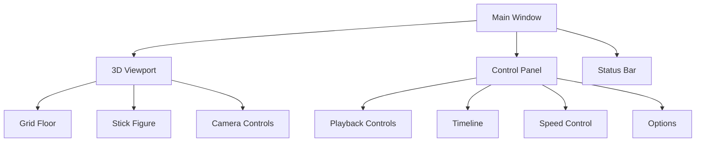
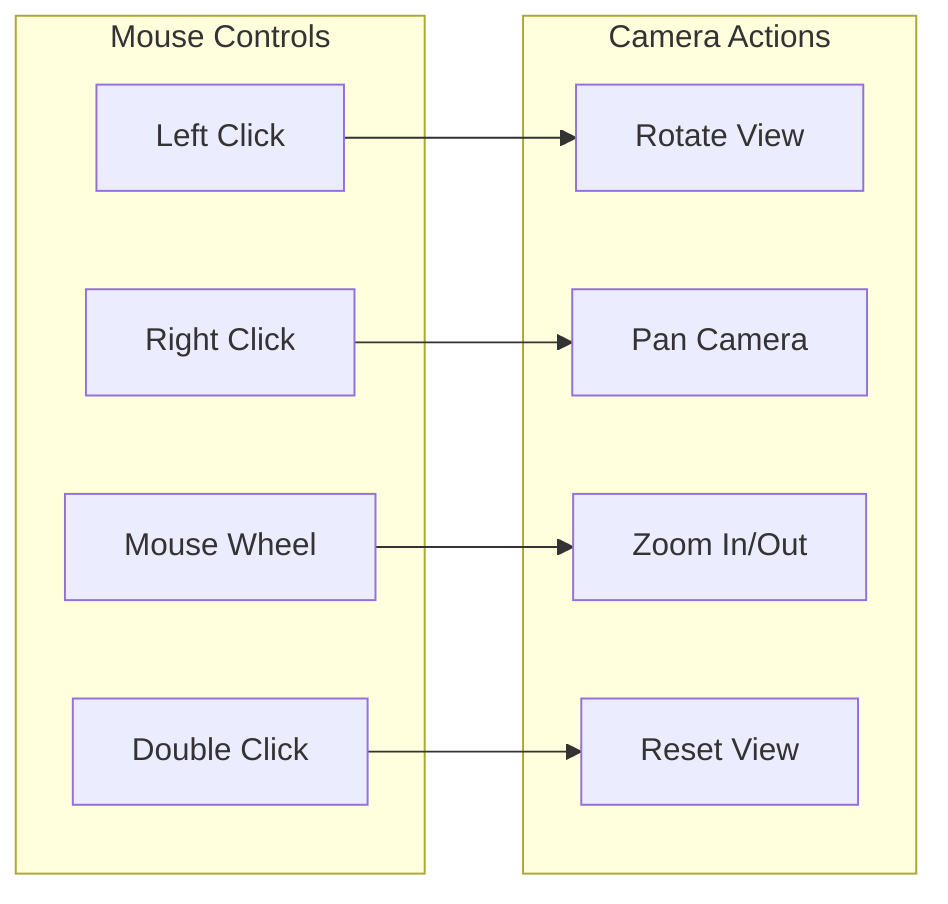
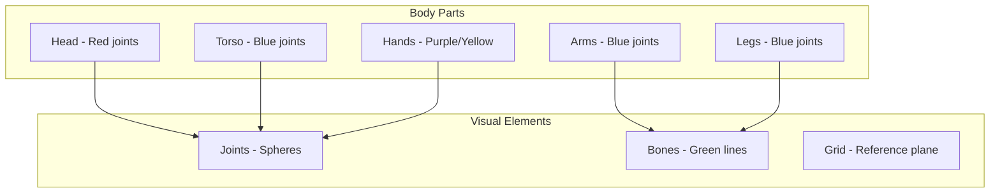
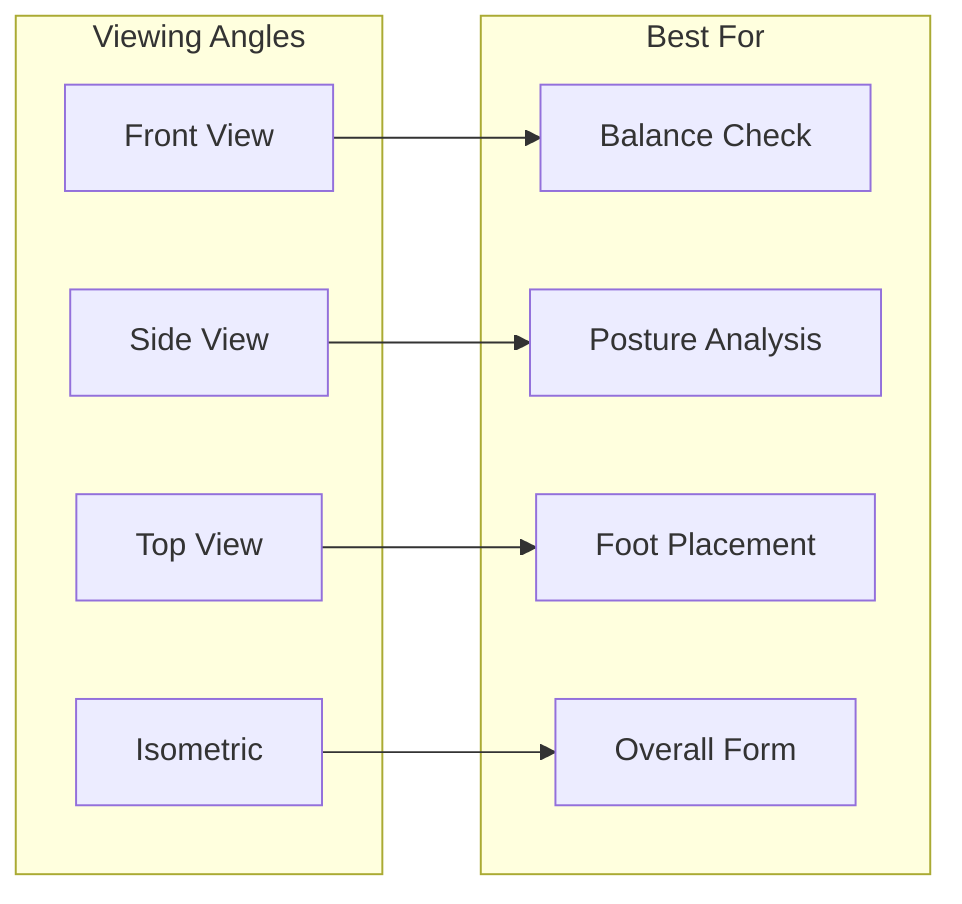
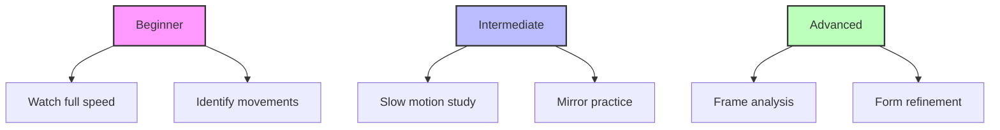

# User Guide

This guide explains how to use the Tai Chi Motion Capture Application to visualize and analyze Tai Chi movements from motion capture data.

## Getting Started

### Launching the Application

1. **Windows**: Double-click the `TaiChiMotionCapture.exe` file
2. **macOS**: Open the `TaiChiMotionCapture.app` from Applications
3. **Linux**: Run the AppImage file: `./TaiChiMotionCapture.AppImage`

### Initial Interface

When you first launch the application, you'll see:



## Loading Animation Data

### Using the File Menu

1. Click **File → Open Animation** or press `Ctrl+O` (Windows/Linux) or `Cmd+O` (macOS)
2. Select a JSON animation file
3. The animation will load and display in the viewport

### Supported File Format

The application expects JSON files with the following structure:
- Motion capture data from video analysis
- 33 pose landmarks per frame
- Optional hand tracking data
- Frame timing information

### Sample Data

The application includes sample animation data for testing. This appears automatically when no file is loaded.

## Viewport Navigation

### Camera Controls

Use your mouse to navigate the 3D scene:

| Action | Control | Description |
|--------|---------|-------------|
| **Rotate** | Left Click + Drag | Orbit around the figure |
| **Pan** | Right Click + Drag | Move camera position |
| **Zoom** | Mouse Wheel | Zoom in/out |
| **Reset** | Double Click | Reset camera to default |



### Viewport Features

- **Grid Floor**: Provides spatial reference
- **Ambient Lighting**: Ensures all parts are visible
- **Directional Shadows**: Adds depth perception
- **Auto-centering**: Figure stays centered during playback

## Playback Controls

### Control Panel Overview

The control panel at the bottom provides all playback controls:

```
┌─────────────────────────────────────────────────────────┐
│ [▶ Play]  [⏮ Reset]  Frame: 45/120  Speed: 1.0x  [☐]Mirror │
│ ━━━━━━━━━━━━━━━━━━━━●━━━━━━━━━━━━━━━━━━━━━━━━━━━━━━━ │
│ Timeline ────────────┘                                    │
└─────────────────────────────────────────────────────────┘
```

### Playback Functions

#### Play/Pause
- Click the **Play** button to start animation
- Click **Pause** to stop at current frame
- Keyboard shortcut: `Space`

#### Timeline Scrubbing
- Drag the timeline slider to jump to any frame
- Click on timeline to jump to approximate position
- Fine control with arrow keys when timeline is focused

#### Speed Control
- Adjust playback speed from 0.1x to 2.0x
- Default speed: 1.0x (original recording speed)
- Useful for studying fast or slow movements

#### Mirror Mode
- Toggle X-axis mirroring with the checkbox
- Helpful for following along with movements
- Maintains proper left/right orientation

### Keyboard Shortcuts

| Key | Action |
|-----|--------|
| `Space` | Play/Pause |
| `R` | Reset to beginning |
| `←` | Previous frame |
| `→` | Next frame |
| `↑` | Increase speed |
| `↓` | Decrease speed |
| `M` | Toggle mirror |
| `F` | Fullscreen |
| `Esc` | Exit fullscreen |

## Understanding the Visualization

### Stick Figure Representation

The 3D stick figure represents the human body with:



### Color Coding

- **Red Joints**: Face and head landmarks
- **Blue Joints**: Body landmarks
- **Green Lines**: Skeletal connections
- **Purple**: Left hand (when tracked)
- **Yellow**: Right hand (when tracked)

### Coordinate System

- **X-axis (Red)**: Left (-) to Right (+)
- **Y-axis (Green)**: Down (-) to Up (+)
- **Z-axis (Blue)**: Back (-) to Front (+)

## Advanced Features

### Frame Analysis

#### Frame Information
The status bar shows:
- Current frame number
- Total frames
- Current time in seconds
- Total duration

#### Frame-by-Frame Navigation
Use arrow keys or timeline controls to analyze individual frames:
1. Pause the animation
2. Use left/right arrows to step through frames
3. Study specific positions and transitions

### Viewing Angles

Recommended viewing angles for different analyses:



### Export Options

#### Screenshot Capture
1. Position the camera for desired view
2. Press `Ctrl+S` to capture screenshot
3. Image saves to Downloads folder

#### Animation Export
1. File → Export Animation
2. Choose format:
   - Video (MP4)
   - Image Sequence (PNG)
   - GIF Animation

## Troubleshooting Common Issues

### Animation Not Playing

1. **Check frame count**: Ensure animation has multiple frames
2. **Reset playback**: Click Reset button
3. **Check speed**: Ensure speed is not 0.0x

### Jerky Playback

1. **Lower quality settings**: Reduce visual quality if needed
2. **Close other applications**: Free up system resources
3. **Check frame rate**: Some animations may have low FPS

### Figure Not Visible

1. **Reset camera**: Double-click viewport
2. **Check data**: Ensure animation file loaded correctly
3. **Zoom out**: Use mouse wheel to zoom out

## Tips for Analysis

### Studying Form

1. **Use slow motion**: Set speed to 0.5x or lower
2. **Focus on key frames**: Pause at important positions
3. **Compare angles**: Use different camera positions
4. **Mirror mode**: Follow along with movements

### Teaching Applications

1. **Demonstration**: Project on large screen
2. **Student practice**: Use mirror mode
3. **Form correction**: Frame-by-frame analysis
4. **Progress tracking**: Compare different recordings

### Research Applications

1. **Biomechanical analysis**: Study joint angles
2. **Movement patterns**: Analyze transitions
3. **Timing studies**: Use frame timing data
4. **Comparative analysis**: Load multiple files

## Best Practices

### Optimal Viewing

- **Lighting**: Ensure good contrast with background
- **Distance**: Zoom to see full figure comfortably
- **Angle**: Use 3/4 view for most analyses
- **Speed**: Start with normal speed, then slow down

### Data Management

- **File organization**: Keep animations in dedicated folders
- **Naming convention**: Use descriptive filenames
- **Backup**: Keep copies of important analyses
- **Version control**: Track different recordings

### Learning Progression



---

For technical details, see:
- [API Reference](../api/README.md)
- [Troubleshooting Guide](./troubleshooting.md)
- [FAQ](../FAQ.md)